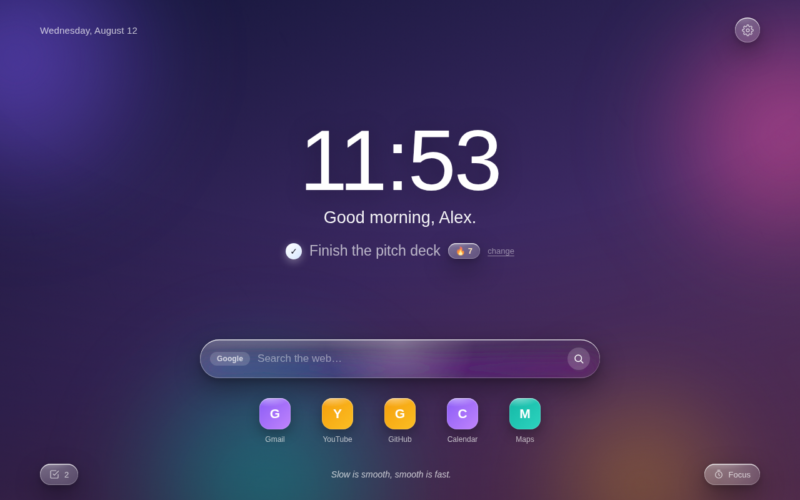

# Hina — a calm new tab 🌅

**Start every new tab with a breath of focus.**

Hina is a global, **English-first** Chrome extension (Manifest V3) that replaces
the new-tab page with a calm, **Liquid Glass** dashboard: a big clock, a living
time-of-day gradient, a daily *one focus* with a completion **streak**, quick
search, speed-dial links, a to-do list, and a Pomodoro timer. Everything runs
**100% on your device** — no account, no server, no tracking.



## What's in this repo

| Path | What it is |
| --- | --- |
| [`extension/`](./extension) | The Chrome extension — plain HTML/CSS/JS, no build step. **This is the product.** |
| `public/dawn/`, `scripts/sync-demo.mjs` | A tiny Next.js host that serves the extension as a **live web demo** on Vercel. |
| `app/`, `next.config.mjs`, `vercel.json` | Next.js glue: the site root (`/`) and `/dawn` both render the Hina demo. |

The extension is the single source of truth; `scripts/sync-demo.mjs` copies its
static files into `public/dawn/` before every build so the demo can't drift.

## Try the extension

1. Open `chrome://extensions`
2. Enable **Developer mode** (top-right)
3. **Load unpacked** → select the [`extension/`](./extension) folder
4. Open a new tab 🎉

Works in any Chromium browser (Chrome, Edge, Brave, Arc, Opera).

## Live web demo (Vercel)

A Chrome extension isn't a website, but Hina is plain static HTML/CSS/JS and
falls back from `chrome.storage` to `localStorage`, so it runs unchanged on the
web. After deploy it's live at:

```
https://<your-vercel-domain>/          (root)
https://<your-vercel-domain>/dawn      (same page)
```

## Develop

```bash
npm install
npm run dev        # http://localhost:3000  → serves the Hina demo
npm run sync:demo  # re-copy extension/ → public/dawn (also runs on build)
```

See [`extension/README.md`](./extension/README.md) for the full feature list,
the near-zero operating-cost breakdown, and the acquisition thesis.

## License

MIT.
